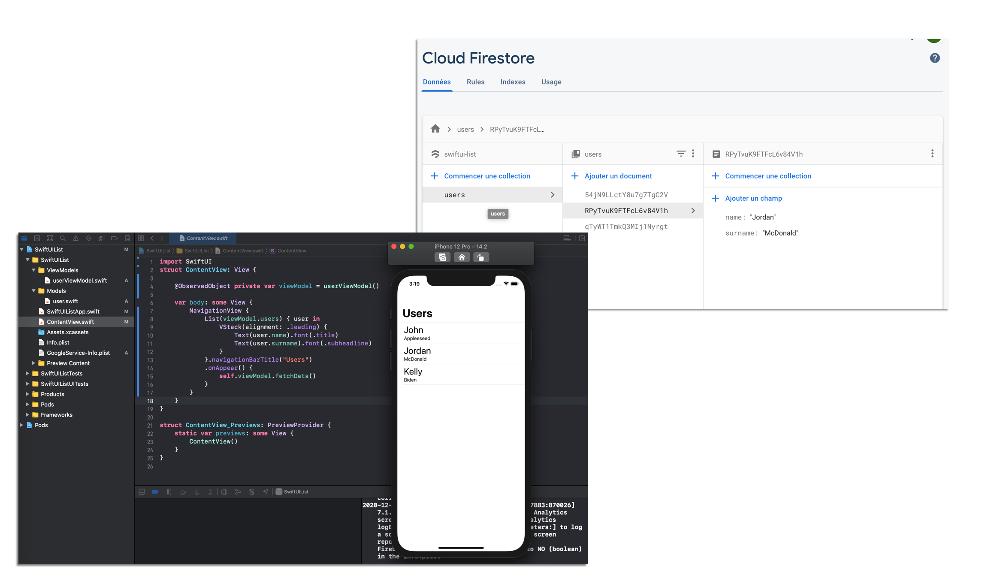

Hey there!
Here is a  simple list fetching data from Firestore using SwiftUI MVVM pattern. 
It's largely inspired from the Firebase You Tube video: https://www.youtube.com/watch?v=f6u3AnOKZd0

Here what's it look's like:

How to install the app?

1. Create a new project at https://firebase.google.com and download the Google-info.plist

2. Drag the Google-info.plist file inside the project folder

3. Go to the project directory and Run "pod install"

4. Inside Firebase Console > Firestore > Start a collection and add some random data

5. Run your project on Xcode!
